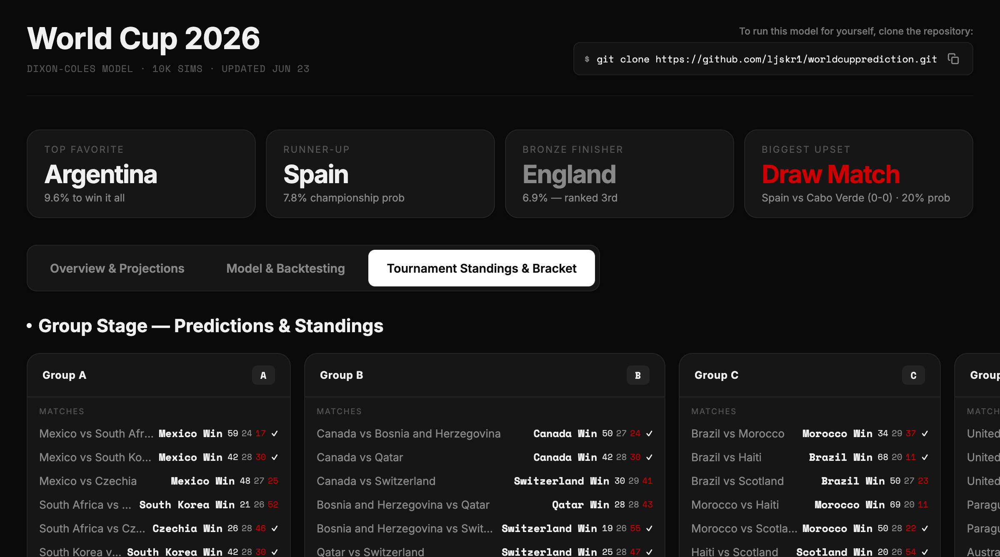

# FIFA World Cup 2026 — Prediction Engine

A statistical prediction engine for the FIFA World Cup 2026 using the **Dixon-Coles Poisson model** with **Monte Carlo simulation** (10,000 runs). Includes an interactive dark-mode dashboard.



## Quick Start

```bash
# Run the prediction engine
python3 simulate_worldcup.py

# View the dashboard
open dashboard.html

# Run Monte Carlo simulation
python3 monte_carlo_simulation.py
```

## How It Works

### The Model: Dixon-Coles Poisson

Standard Poisson models treat every match independently with a flat ~24% draw probability. Real football doesn't work that way — draws range from ~16% (lopsided matches) to ~29% (evenly matched teams).

The **Dixon-Coles model** (1997) adds a correlation parameter **ρ = -0.13** that adjusts for the reality that low-scoring games are correlated events. If Team A fails to score, Team B is statistically more likely to also fail to score.

**Effect:** Draw probabilities now vary by matchup strength instead of being a flat average.

### Data Inputs (per team)

| Input | Description | Source |
|-------|-------------|--------|
| FIFA Rankings | ELO baseline (June 2026 official) | FIFA |
| Attack/Defense | 0-100 scale, derived from FIFA rank + goal averages | Computed |
| Recent Form | Last 10 matches → W/D/L → form multiplier (0.85x–1.15x) | Computed |
| Injuries | Position-specific penalty (2.5–5.0 pts per player) | Manual |
| Home Advantage | 1.04x multiplier for co-hosts (Mexico/Canada/USA) | Manual |
| Actual Results | 26 played group stage matches locked in | FIFA |

### Match Prediction Pipeline

```
1. Calculate effective ratings
   base_attack * form_mult * tactical_mult * home_mult - injury_penalty

2. Compute expected goals (λ)
   λ₁ = 1.35 × (att₁ / avg_att) × (avg_def / def₂)
   λ₂ = 1.35 × (att₂ / avg_att) × (avg_def / def₁)

3. Build Poisson probability matrix (0-10 goals each side)
   P(i,j) = Poisson(λ₁, i) × Poisson(λ₂, j) × τ(i,j)

4. Apply Dixon-Coles adjustment τ
   ρ = -0.13 (standard academic value)

5. Aggregate into P(win), P(draw), P(lose)
```

### Monte Carlo Simulation

10,000 independent tournament simulations:
- Group stage: simulate remaining matches using Poisson + Dixon-Coles
- Knockout: deterministic bracket (higher probability advances)
- Track: qualification rate, group win rate, R16/QF/SF/final reach, championship probability

Seed: `42` (reproducible)

## Key Results

### Championship Probabilities (10,000 sims)

| Rank | Team | Champion % | Reach Final % |
|------|------|-----------|---------------|
| 1 | 🇪🇸 Spain | 11.5% | 19.9% |
| 2 | 🇦🇷 Argentina | 10.6% | 17.9% |
| 3 | 🇫🇷 France | 6.9% | 12.3% |
| 4 | 🏴󠁧󠁢󠁥󠁮󠁧󠁿 England | 6.0% | 10.6% |
| 5 | 🇵🇹 Portugal | 5.6% | 9.7% |
| 6 | 🇧🇪 Belgium | 5.4% | 10.4% |
| 7 | 🇲🇦 Morocco | 4.8% | 9.4% |
| 8 | 🇺🇾 Uruguay | 4.8% | 10.2% |

### Predicted Final Bracket

```
              🇪🇸 SPAIN (Champion)
                    │
            ┌───────┴───────┐
       🇦🇷 Argentina    🇫🇷 France
            │               │
       ┌────┘               └────┐
   🇳🇱 Netherlands         🏴󠁧󠁢󠁥󠁮󠁧󠁿 England
       │                         │
   ┌───┘                         └───┐
🇺🇸 United States              🇨🇴 Colombia
```

## Project Structure

```
worldcuppreiction/
├── simulate_worldcup.py      # Main prediction engine (Dixon-Coles + MC)
├── monte_carlo_simulation.py # Secondary MC script (imports from above)
├── dashboard.html            # Dark-mode BI/BA dashboard (standalone HTML)
├── data.js                   # Generated JS data (teams, standings, bracket)
├── monte_carlo_results.json  # MC simulation output (top 48 teams)
├── worldcup_2026_predictions.md  # Markdown prediction report
├── predictions.html          # Earlier HTML version (4 tabs)
├── LINKEDIN_POST.md          # LinkedIn post templates
├── styles.css                # Original CSS (unused by dashboard)
├── app.js                    # Original JS (unused by dashboard)
└── index.html                # Original entry point
```

## Dashboard Features

- **KPI Cards**: Champion, Runner-Up, Third Place, Title favorites
- **Overview Tab**: All match predictions with win/draw/loss probabilities
- **Groups Tab**: 12 groups with standings, fixtures, and scores
- **Advancement Tracker**: Who's through, who's on the bubble, who's eliminated
- **Bracket Tab**: Full vertical tournament path (R32 → R16 → QF → SF → Final)

**Design**: Dark mode, glass morphism, DM Sans + Space Mono fonts, fully responsive.

## Running Locally

```bash
# Clone
git clone https://github.com/YOUR_USERNAME/worldcuppreiction.git
cd worldcuppreiction

# Run prediction engine
python3 simulate_worldcup.py

# Open dashboard in browser
open dashboard.html

# Or serve locally
python3 -m http.server 8080
# Then visit http://localhost:8080/dashboard.html
```

## Hosting on the Web

### Option 1: GitHub Pages (simplest)

```bash
# Push to GitHub
git init
git add .
git commit -m "World Cup 2026 prediction engine"
git remote add origin https://github.com/YOUR_USERNAME/worldcuppreiction.git
git push -u origin main

# Enable GitHub Pages
# Go to repo → Settings → Pages → Source: "Deploy from a branch" → Branch: main
# Your dashboard will be live at: https://YOUR_USERNAME.github.io/worldcuppreiction/dashboard.html
```

### Option 2: Vercel

```bash
# Install Vercel CLI
npm i -g vercel

# Deploy
vercel --prod

# Gets a URL like: https://worldcuppreiction.vercel.app/dashboard.html
```

### Option 3: Netlify

```bash
# Drag-and-drop the folder to https://app.netlify.com/drop
# Or use CLI:
npm i -g netlify-cli
netlify deploy --prod --dir=.
```

### Option 4: Cloudflare Pages

```bash
# Push to GitHub, then connect in Cloudflare Pages dashboard
# Or use Wrangler:
npx wrangler pages deploy . --project-name=worldcup-2026
```

**Recommended for LinkedIn**: GitHub Pages. Free, fast, reliable, and the URL looks professional.

## Technical Notes

- **ρ = -0.13**: Standard Dixon-Coles correlation parameter from academic literature
- **Base goals**: 1.35 expected goals per team in a neutral match
- **Goal bounds**: Clamped to 0.4–3.5 range to prevent extreme λ values
- **Knockout resolution**: Higher-probability team advances (no penalty simulation in MC)
- **Third-place selection**: Top 8 third-place teams by (pts, GD, GF)

## License

MIT
